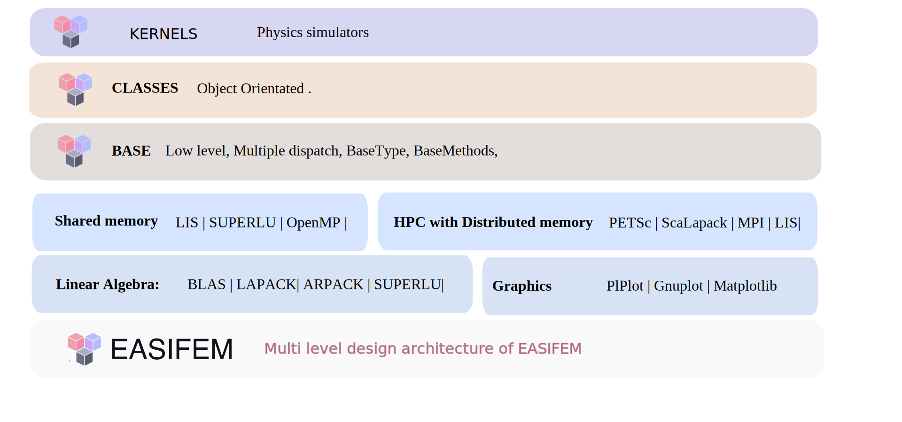

# EASIFEM

EASIFEM is modern-fortran platform developed to facilitate Expandable And Scalable Infrastructure for Finite Element Methods. It is designed to solve partial differential equations (PDEs) using finite element methods. However, you can also implement finite difference and finite volume methods by using it. You can also plot graphs, generate mesh, and perform linear algebra related stuffs. But the main feature of EASIFEM is to “eases” the efforts to develop scientific programs in FORTRAN. It is meant for researchers, scientists, and engineers using FORTRAN to implement numerical methods for solving the initial-boundary-value problems (IBVPs). EASIFEM is equipped with both low- and high-level datatype and classes for implementing finite element methods.

Following are some features which may interest you.

- Building, installing, updating, and linking EASIFEM is painless.
- EASIFEM provides much helpful functionality, such as Mesh-generation, Domain creation, a massive list of shape functions, 1D/2D/3D elements, 1D/2D/3D plotting, file input-output, constitutive material laws, linear solvers, sparse-matrices, full support for performing linear algebra analysis, Fast Fourier Transform, among many other features.
- One of the strengths of EASIFEM is its comprehensive documentation and command line interface.
- EASIFEM comes with snippets and automation scripts for vs-code and vim users.
- Expanding EASIFEM as per your requirement; you can link a new library with EASIFEM or link EASIFEM with your own software library.

## Structure of EASIFEM

EASIFEM consists following three hierarchical components:

- **Base** `libeasifemBase`
- **Classes** `libeasifemClasses`
- **Kernels** `libeasifemKernels`

## Base

`easifemBase` (henceforth read as Base) contains a lot of valuable routines and derived types. In Base, we do not use object-oriented programming concepts and mainly use [multiple dispatch approach](https://en.wikipedia.org/wiki/Multiple_dispatch). This approach improves the flexibility and speed of `easifemBase`. All user-defined datatype are declared in the `BaseType` module, and all methods are exposed through `BaseMethods` modules.

:::info Base
Currently, `easifemBase` has interface with `BLAS95`, `Lapack95`, `Sparsekit`, `Metis`, `PlPlot`, `SuperLU`, `ARPACK`, etc.
:::

## Classes

`easifemClasses` (hereafter, read as the Classes) defines high-level derived types such as domain, mesh, fields, linear solvers, etc. Classes are primarily based on [object-oriented programming](https://en.wikipedia.org/wiki/Object-oriented_programming). Most of the functionality of Classes comes from the Base. In other words, most of the computation is deployed to the Base library. This approach improves flexibility at the cost of reducing some speed.
:::info `Classes`
Currently, `easifemBase` has interface with `HDF5`, `Gmsh`, `PlPlot`, `GTK4`, `PETsc`, `Matplotlib`, `Python`, `Lua`, etc. In the future, we will add interfaces to many other useful FORTRAN and C libraries.
:::

## Kernels

`easifemKernels` (henceforth, read as Kernels) contains physics simulators. For example, we have:

- Abstract Kernels
- Elasticity analysis of soils and solids
- Elastodynamics analysis of soils and solids
- Elasto-plastic analysis of soils and solids
- Large deformation with Hyper Elastic material behavior
- Heat conduction, convection, radiation in soils and solids
- Darcy-flow in fully saturated and variably saturated soils
- Darcy-Brinkman flow in saturated soils
- Solver for convection-diffusion-reaction in single variable
- Stokes flow
- Incompressible and Isothermal Navier-Stokes Flow
- Space-Time Finite element methods

## Programming paradigm

EASIFEM manly follows two types of programming paradigm:

- Object-oriented-programming (OOP)
- Multi-dispatch programming.

## System requirements

Before installing the EASIFEM, please make sure your system is up-to-date and have requirements mentioned [here.](./SystemRequirements.md)

## External packages

Before installing the EASIFEM, make sure to install the external packages on your system by following the details given [here.](./SystemRequirements.md)
